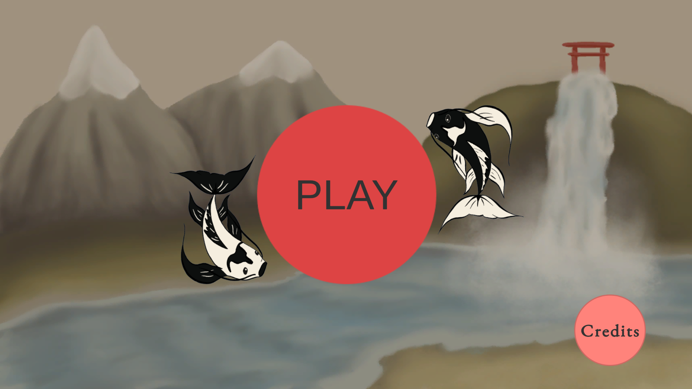
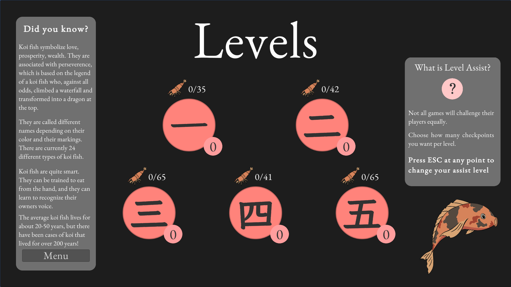
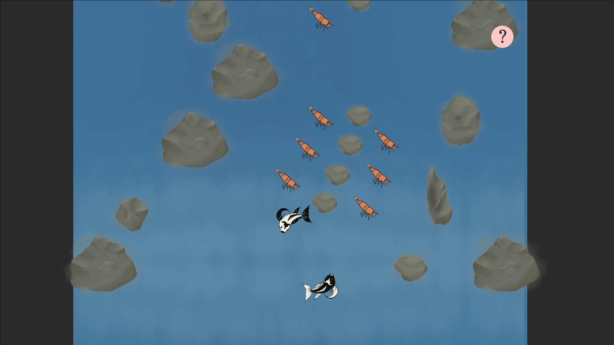

# Koi Climb

This game was completed in 13 days for the [Gamedev.js Jam 2025](https://itch.io/jam/gamedevjs-2025), hosted on [itch.io](https://itch.io/).

Balance two koi fish at once while trying to get to the top of the waterfall. Koi Climb was inspired by my student exchange in Japan (March - August 2025).

[Play the game here](https://vin-games.itch.io/koi-climb)

